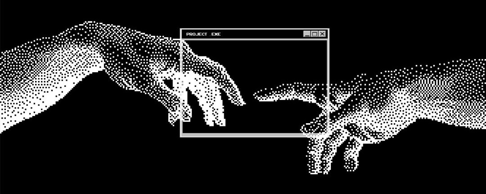

  <!-- Creation of Adam Cropped Banner -->
  

    

  <h1>Hi 👋, I'm Adesh</h1>
  <h3>Data Engineer & Applied AI / ML Practitioner</h3>

  
<i>Building deterministic SLM pipelines, high-throughput microservices, and autonomous agents.</i>

   

---

### 🚀 About Me

  <!-- Borderless Astronaut Floating Right -->
  

**Adesh** here — Data Engineering & ML developer from India, specializing in enterprise data workflows, scalable ETL architectures, and structured semantic pipelines.

I build production-ready systems with **Python, PyTorch, FastAPI, PostgreSQL, and Docker**, focusing on deterministic outputs and sub-millisecond data ingestion.

Currently diving deep into **SLM Distillation (QLoRA/PEFT), Model Context Protocol (MCP) governance**, and **AST static validation via Tree-sitter & sqlglot**.

My goal: bridge the gap between heavy research models and lean, deterministic production software that scales effortlessly.

 

---

### 🤝 Connect

  
  
  
  

---

### 💻 Tech Stack

  

---

### 🛠️ Flagship Systems

<table>
  <tr>
    <td width="33%" valign="top">
      <h4>🧠 SLM Distillation Pipeline</h4>
      
4-bit QLoRA distillation transferring enterprise SQL synthesis into an 8B SLM with <code>sqlglot</code> AST validation.

      <a href="https://github.com/adexxhh/slm-finetuning-distillation-pipeline"><b>View Repository ➔</b></a>
    </td>
    <td width="33%" valign="top">
      <h4>⚡ Async Agent Core Engine</h4>
      
Decoupled async microservice serving <b>446+ RPS</b> at 0.88ms latency with LangGraph and Redis SSE streaming.

      <a href="https://github.com/adexxhh/autonomous-code-editor"><b>View Repository ➔</b></a>
    </td>
    <td width="33%" valign="top">
      <h4>🛡️ MCP Database Auditor</h4>
      
Model Context Protocol server blocking destructive mutations in <b>0.35ms</b> with statistical data profiling.

      <a href="https://github.com/adexxhh/mcp-database-auditor"><b>View Repository ➔</b></a>
    </td>
  </tr>
</table>

---

### 📊 GitHub Stats

  

 

### 📈 Activity Graph

  

---

  

